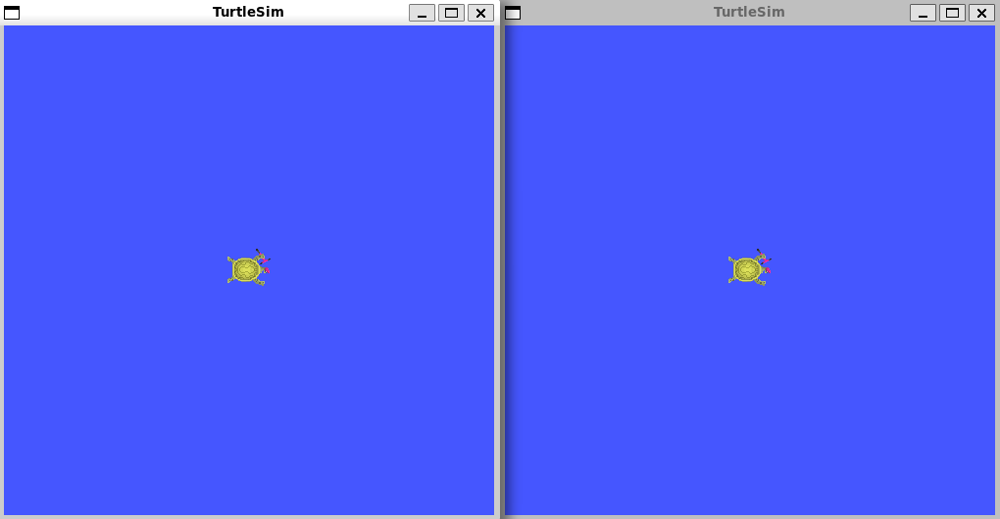
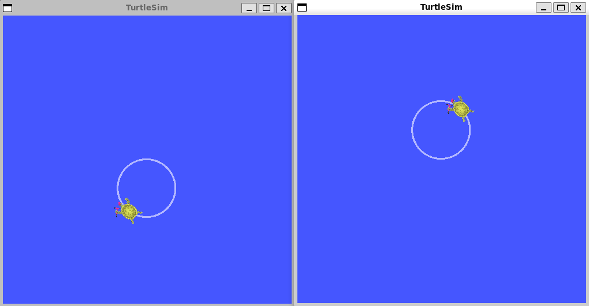

## Launching nodes
Цель: Научиться использовать средства командной строки чтобы запускать несколько узлов за раз
До этого мы запускали один узел в одном терминале. Это - плохо, так как при создании сложных систем требуется запускать большое количество узлов, а запускать их в разных терминалах неудобно.
### Запуск исоплняемого файла
Откроем терминал и введем следующую команду:
```bash
ros2 launch turtlesim multisim.launch.py
```
Код на Python в файле multisim.launch.py:
```bash
from launch import LaunchDescription
import launch_ros.actions

def generate_launch_description():
    return LaunchDescription([
        launch_ros.actions.Node(
            namespace= "turtlesim1", package='turtlesim', executable='turtlesim_node', output='screen'),
        launch_ros.actions.Node(
            namespace= "turtlesim2", package='turtlesim', executable='turtlesim_node', output='screen'),
    ])
```
После выполнения откроется два окна с черепашками:

### Управление узлами
Запущенными узлами можно управлять так же, как мы делали это в предыдущих главах. Так, запустив еще один терминал и введя туда команду:
```bash
ros2 topic pub  /turtlesim1/turtle1/cmd_vel geometry_msgs/msg/Twist "{linear: {x: 2.0, y: 0.0, z: 0.0}, angular: {x: 0.0, y: 0.0, z: 1.8}}"
```
Потом запустив еще один терминал и введя команду:
```bash
ros2 topic pub  /turtlesim2/turtle1/cmd_vel geometry_msgs/msg/Twist "{linear: {x: 2.0, y: 0.0, z: 0.0}, angular: {x: 0.0, y: 0.0, z: -1.8}}"
```
Увидим следующее:

