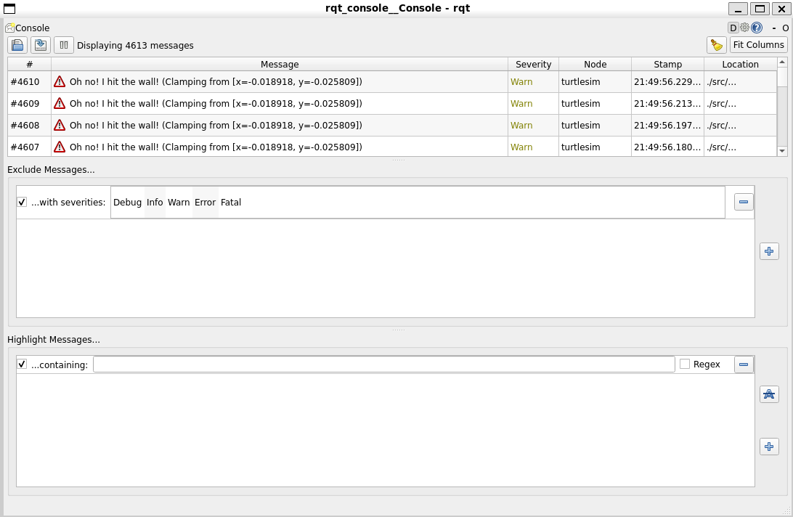

## Using rqt_console to view logs
Цель: познакомиться с rqt_console, чтобы научиться анализировать записи в логе ROS2.
rqt_console - это графический инструмент, используемый для просмотра записи в логе ROS2. С помощью rqt_console можно собирать, просматривать, фильтровать, сохранять и загружать записи в логах.
### Запуск rqt_console
Чтобы запустить rqt_console, нужно ввести команду
```bash
ros2 run rqt_console rqt_console
```
В результате откроется окно:

В первом разделе консоли отображаются сообщения.
Второй раздел предназначен для фильтрации сообщений.
В третьем разделе можно выделять сообщения.
### Сообщения в rqt_console
Заставим черепаху врезаться в стену. Введем в новом терминале команду
```bash
ros2 topic pub -r 1 /turtle1/cmd_vel geometry_msgs/msg/Twist "{linear: {x: 2.0, y: 0.0, z: 0.0}, angular: {x: 0.0,y: 0.0,z: 0.0}}"
```
Взглянем в rqt_console

Так как черепаха постоянно врезается в стену, в консоль непрерывно поступают предупреждения об этом.
### Уровни логгеров в rqt_console
Уровни логгеров в ROS2 упорядочены по степени серьезности:
```bash
Fatal
Error
Warn
Info
Debug
```
Чтобы установить уровень логгера по умолчанию при первом запуске узла /turtlesim с помощью команды
```bash
ros2 run turtlesim turtlesim_node --ros-args --log-level WARN
```
